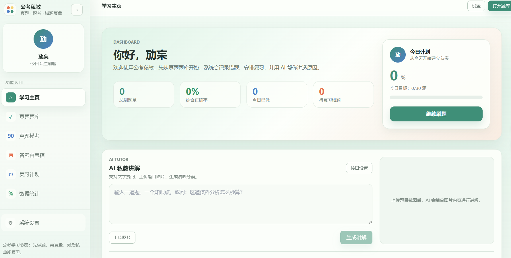
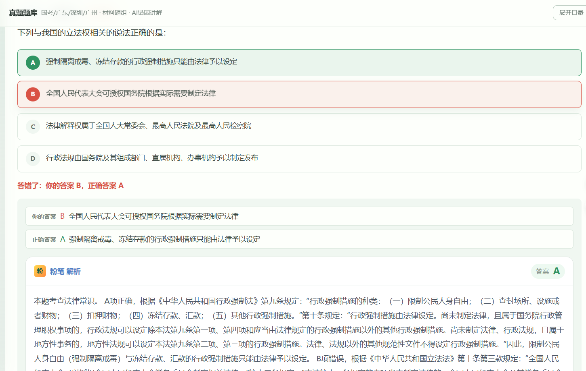
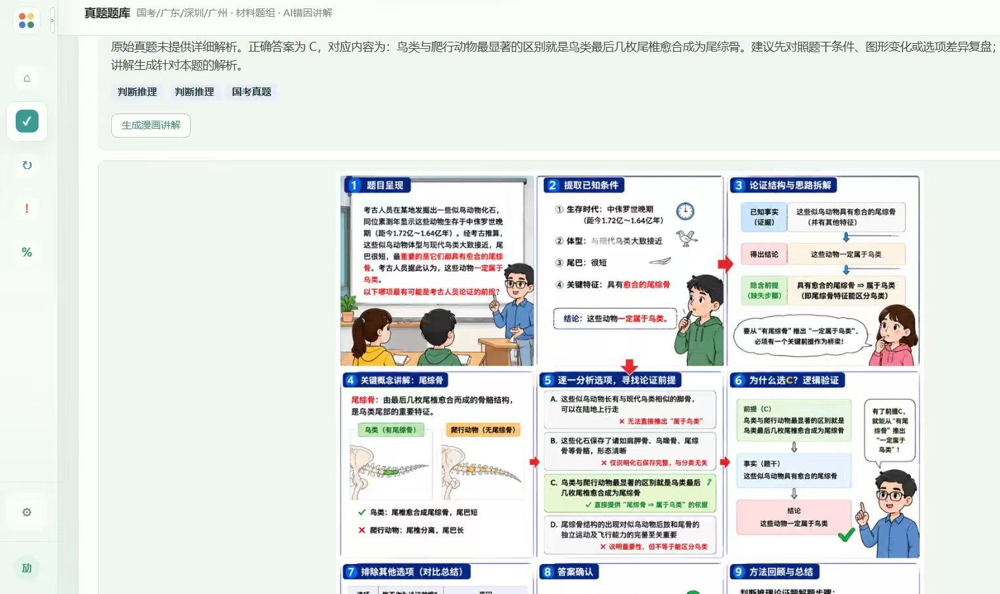
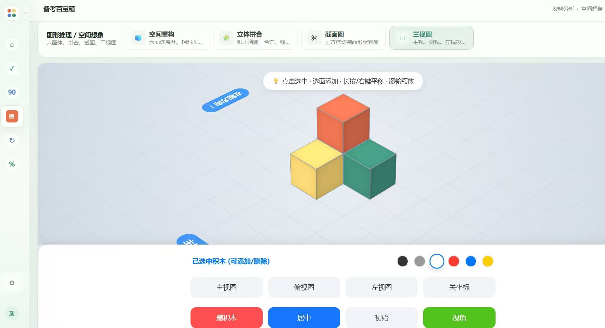

# 公考私教

公考刷题、模考、错题复习、百宝箱工具和 AI 讲解一体化学习应用。项目基于 Next.js，移动端可通过 Capacitor 打包为 Android APK。

## 界面预览


学习主页：集中查看刷题数据、今日计划和 AI 私教讲解入口。


真题题库：展示作答结果、正确答案和粉笔解析内容。


漫画讲解：把题目思路拆成分镜，便于复盘关键步骤。


备考百宝箱：提供空间重构、截面图和三视图等训练工具。

## 功能

- 真题题库：支持搜索、考试/年份/试卷筛选、材料题组练习。
- 真题模考：按整套试卷计时训练。
- 错题复习：按复习计划回看错题，并可生成错因讲解。
- 备考百宝箱：资料分析、空间重构、截面图、三视图、记忆卡片等工具。
- AI 设置：文本讲解和生图接口均从系统设置或运行环境读取，不在仓库中内置 API Key。

## 本地运行

```bash
npm install
copy .env.example .env
npm run dev
```

打开 `http://localhost:3000`。

## Agnes AI 配置

文字讲解和漫画生图已统一使用 Agnes AI：

- 网关：`https://apihub.agnes-ai.com/v1`
- 文字：`POST /v1/chat/completions`
- 图片：`POST /v1/images/generations`
- 鉴权：`Authorization: Bearer <AGNES_API_KEY>`

托管网页推荐只在服务端配置：

- `AGNES_API_KEY`
- `AI_TEXT_MODEL`（默认 `gpt-4.1-mini`）
- `AI_IMAGE_MODEL`（默认 `agnes-image-2.1-flash`）
- `AI_IMAGE_SIZE`（默认 `1K`）
- `AI_IMAGE_RATIO`（默认 `1:1`）

应用内「我的 / Agnes AI 接口」可为静态站点或 Capacitor 客户端保存设备 Key。留空保存会保留已有 Key；旧供应商 Key 不会迁移或发送到 Agnes 域名。浏览器设备存储不是加密保险箱，公开网站应使用 `/api/ai` 与 `/api/image` 服务端代理。

`EMBED_PUBLIC_AI_KEYS=1` 只适合完全私有的移动构建，它会把 `AGNES_API_KEY` 注入客户端包。公开网站、GitHub Pages 和公开分发 APK 不要开启。

## Web 构建

```bash
npm run build
```

移动端静态导出：

```bash
npm run build:mobile
```

## Android APK

准备 Android SDK 和 JDK 21 后执行：

```bash
npm run build:mobile
npx cap sync android
cd android
gradlew assembleDebug
```

生成文件：

```text
android/app/build/outputs/apk/debug/app-debug.apk
```

## GitHub / Vercel 部署

1. 将代码推送到 GitHub。
2. 在 Vercel 导入该 GitHub 仓库。
3. 构建命令使用 `npm run build`。
4. 如果需要服务端 Agnes AI 配置，在 Vercel Project Settings 里添加环境变量。
5. 不要把 `.env`、APK、构建目录或日志提交到仓库。

## GitHub Pages 自定义域名

本仓库也可以发布为静态站点，并绑定自定义域名，例如 `lhp.enener.com`。静态站点没有 Next.js 服务端 API，浏览器会在 `/api` 不可用时尝试直连设置页保存的 AI 接口；这要求模型接口允许浏览器跨域请求。需要隐藏 Key 并稳定使用文本/生图接口时，必须使用 Vercel、Node 服务器或其他支持服务端函数的部署方式。

DNS 需要添加：

```text
类型: CNAME
名称: lhp
值: huanpeng69-cmyk.github.io
代理: DNS only / 关闭代理
```

域名异常时可本地执行：

```bash
npm run check:site
```

如果提示 `DNS record is missing`，说明 Cloudflare 里的 `lhp` 解析记录不存在或未生效，需要按上面的 CNAME 重新添加。

## 安全说明

- 仓库只保留 `.env.example`，真实 `.env` 已被忽略。
- APK、`out/`、`.next/`、Android build 输出、日志和浏览器检查缓存均已加入 `.gitignore`。
- 如果某个 API Key 曾经被提交到公开仓库，应立即到模型服务商后台撤销并重新生成。
